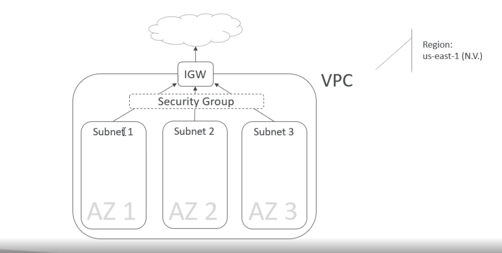

# AWS EKS , Kubernetes on AWS

[Udemy Course](https://www.udemy.com/course/amazon-eks-starter-kubernetes-on-aws/?couponCode=MAY_20_GET_STARTED)
authors:
- Gerd 
    - [github](https://github.com/gkoenig)
- Stephane
    - [github](https://github.com/simplesteph)
    - [medium](https://medium.com/@stephane.maarek)

## Intro
AWS infrastructure of EKS

Course Activities:
- Deploy EKS cluster using CloudFormation
- Scale K8s cluster
- Setup kubectl to access cluster
- EKS and integrations with AWS
- K8s Dashboard
- Deploy a stateless app on EKS and expose it with a public ELB
- Deploy a statefull app on EKS and bind it with EBS volumes
- Deploy a statefull app (wordpress) with EFS network drives
- AWS CLI and eksctl CLI

## 1 AWS EKS cluster setup

**AWS EKS cluster sut up**
- I am going to use for this course the  to use the **Region=us-east-1** (N. Virgunia)
- **Create IAM role** k8s assumes this role to create AWS resources
    - role name **AWSServiceRoleForAmazonEKS**
- **Create ssh key** to be able to ssh our EC2 instances
    - for us-east-1 is different region and we will use another key
        - rig-virginia-key.pem
- **Create Access key + secret** to enable authentication for API access
    - previously created, check the Region on the .aws/config file

**Cluster Infrastructure** on eu-west-1

CloudFormation template uploading:

- Create the infrastructure using **CloudFormation**
    - upload file 1../eks-course-vpc.yaml
        - EKS-course-stack

- Configuration of EKS, on AWS dashboard we go to EKS, here is important to check with what account the EKS is created. If there are problems with accessing the cloud form the terminal then i solved it accessing the AWS dashboard with my IAM user and not with my SSO account, because the ARN is different and there are problems in accessing the cluster using kubectl. Once you have access to the cluster then we can give access to other users using the ARN and the below file configuration **aws-auth**
    - EKS-course-cluster-udemy

**Setting up the kubectl**

How it works, executing kubectl commands require:

- kubectl config file
    - EKS endpoint
    - User authentication
        - aws-iam-authenticator executable
            - generates an authentication token based on 
                - aws credentials file
    
- [install & configure](https://docs.aws.amazon.com/eks/latest/userguide/install-kubectl.html)  **kubectl**. 

Check the installed version of kubectl
    
    kubectl version --short --client

- Installing aws-iam-authenticator

- configure the credentials file where the aws-aim-authenticator refers to which is the .aws/credentials
    - check if it is working

            aws-iam-authenticator token -i EKS-course-cluster-udemy | python -m json.tool

There are different ways of configuring .kube/config, the aes
- **Configuration file for kubectl**

        mkdir $HOME/.kube && nano $HOME/.kube/kube-config-eks
        export KUBECONFIG=$HOME/.kube/kube-config-eks

There are different ways of configuring .kube/config, but in case of problems with connection to the AWS cluster, [follow this one](https://aws.amazon.com/premiumsupport/knowledge-center/eks-api-server-unauthorized-error/).
For a template of the **aws-auth ConfigMap** to add to the cluster configuration for allowing other IMA users to access the cluster, follow the previous tutorial and use this file for configuring a the [ConfigMap](./1_CloudFormation/aws-auth-configmap.yaml)

## Deploying the worker nodes

We will be creating 
- autoscaling group (ASG) 
- with EC2 instances
- which are split across three subnets
- on three different AZ

To achieve this goal we are going to do the following steps:
- CloudFormation stack template to create worker, security-group, ...
- Worker nodes are EC2 instances in an auto-scaling-group
- EC2 instances based upon a particular AMI by AWS specific for k8s that contains already kubelet, docker, authenticator
- allowing nodes, based on the assumed role, to join EKS cluster. we will be creating configMaps for k8s control plane to allow the Rol to join our EKS cluster. This role will be assumed by the EC2 instances to be able to join the cluster. 

**Deploying the CloudFormation Node group stack**

# 4. EKS in deep 

## Kubernetes Contol Plane

In EKS
- the **Master and Etcd** are managed by **AWS**
- the **worker nodes** are managed by the **USER**

**EKS Control Plane Deep Dive**
- Eks k8s Control plane is highly available
- single tenant ( you do not share it with other customers because deployed in our VPC)
- made of native AWS components (EC2, ELB, ASG, NLB, VPC)
- the whole control plane is fronted by an **NBL** (provides fixed IP to the control plane)

*ASG (Auto Scaling Group), 
*NLB (Network Load Balancer)

## EKS Networking

### **VPC**

- Recommended to have:
    - **Private subnets**: contains all the worker nodes to have the application deployed. Must be large CIDR (1.1.1.1/16).
    - **Public subnets**: will contain aby **internet-facing** load balancer to expose the applications.
- Private only means you can't expose your apps
- Public only means your worker nodes are exposed to the internet
- The VPC must have **DNS hostname** and **DNS resolution support**, otherwise nodes can't register with the Control Plane.

### **Security Groups**

- You control 2 security groups:
    - **Control Plane** 
    - **Worker Nodes**
- information on AWS best practices

**Mater node security Group rules**

**Worker node security Group rules**

### **EKS Pod Networking**
- Amazon VPC CNI plugin: **each pod receives 1 IP address** (=ENI) in VPC
    - ENI = An elastic network interface is a logical networking component in a VPC that represents a virtual network card.
- Each pod receives an **Ip address in the VPC**, this means that Pods have the exact same IP address inside EKS cluster and outside it. That means that the applications outside the EKS cluster can interact with the Pods using this Ip addresses.
- Subnet Limitations:
    - CIDR/ is  254 IP, not enough to run a lot of pods
    - CIDR/18 is a lot more IP (16.384), better for running more pods.
- EC2 limitations:
    - EC2 instances can only have a limited amount of ENI/IP address, this means a limit number of Pods that can run inside them. **#IP == #Pods**
    - For each EC2 instance we have the max number of Network Interfaces and the IP addresses per Interface
        - **c5.large: (max # interfaces ) 3 x (# IPs per interface 10) = (number of overall IPs/Pods) 30**
        - **t2.micro: (max # interfaces ) 2 x (# IPs per interface 2) = (number of overall IPs/Pods) 4**

## [**Calico**](https://www.projectcalico.org/)

Calico handles network polices in place.
- Security groups allow all worker nodes to communicate to each other on any ports
- This may be a problem if you want to segment applications, tenants, or environments
- Instead of dealing with AWS Security Groups, we can install project **Calico** onto **EKS**
- With Calico teh network policies are directly assigned to pods (instead of worker nodes)
- It effectively reproduce what security groups do but this time at Pod level.
    - This Pods belong to this Calico rule

### **Kubernetes IAM (Identity Access Management) & RBAC (Role Based Access Control) Integration**
- Authentication is held by IAM
- Authorization is done by K8s RBAC ( native auth for K8s)
- This is done through a collaboration done between AWS and Heptio
- You can assign RBAC rules directly to IAM entities.
- By default, the role you assign to your K8s cluster has **system:master permissions**

### **K8s worker nodes**

- When you create a **worker node/group**, assign an IAM role, and authorize that role in RBAC to join **system:bootstrappers** and **system:nodes** in the [ConfigMap](https://docs.aws.amazon.com/eks/latest/userguide/add-user-role.html)
- this file will allow our group nodes to joining our k8s cluster.

        apiVersion: v1
        kind: ConfigMap
        metadata:
        name: aws-auth
        namespace: kube-system
        data:
        mapRoles: |
            - rolearn: arn:aws:iam::xxxxx:role/eks-course-worker-nodes-NodeInstanceRole-13MTCXACD5LA3
            username: system:node:{{EC2PrivateDNSName}}
            groups:
                - system:bootstrappers
                - system:nodes

## EKS Load Balancers

- EKS support 
    - Classic Load Balancer, 
    - Applications Load Balancer 
    - Network LoadBalancer
- Classic & Network Load Balancer is for Service of type **LoadBalancer**